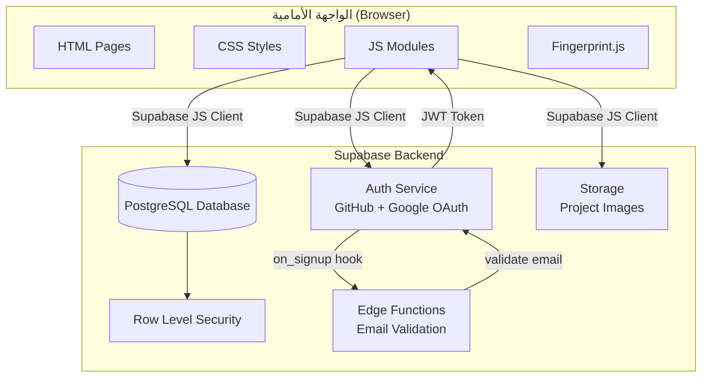

# وثيقة التصميم - Student Projects Hub

## نظرة عامة

Student Projects Hub تطبيق ويب يعتمد بنية بسيطة بدون إطار عمل (Vanilla HTML/CSS/JS) مع Supabase كـ Backend as a Service. التطبيق يقوم على فصل واضح بين طبقة العرض (HTML/CSS) وطبقة المنطق (JS modules) وطبقة البيانات (Supabase).

يعمل التطبيق بشكل Single Page Application جزئي: الصفحات الرئيسية منفصلة (HTML files) بينما التفاصيل والنماذج تُحمَّل ديناميكياً.

---

## المعمارية



---

## المكونات والواجهات

### هيكل الملفات

```
student-projects-hub/
├── index.html              # الصفحة الرئيسية - عرض المشاريع
├── project.html            # صفحة تفاصيل المشروع
├── publish.html            # صفحة نشر/تعديل مشروع
├── admin.html              # لوحة تحكم الأدمن
├── manifest.json           # إعدادات PWA
├── sw.js                   # Service Worker للعمل offline
├── assets/
│   ├── logo.svg            # شعار الموقع (قابل للاستبدال)
│   └── icons/              # أيقونات PWA (192x192, 512x512)
├── locales/
│   ├── ar.json             # نصوص الواجهة بالعربية
│   ├── en.json             # نصوص الواجهة بالإنجليزية
│   └── tr.json             # نصوص الواجهة بالتركية
├── css/
│   ├── style.css           # الأنماط العامة + RTL/LTR
│   ├── cards.css           # أنماط البطاقات
│   └── forms.css           # أنماط النماذج
├── js/
│   ├── supabase.js         # تهيئة Supabase Client
│   ├── i18n.js             # نظام اللغات المركزي
│   ├── auth.js             # منطق المصادقة
│   ├── projects.js         # CRUD المشاريع
│   ├── likes.js            # منطق الإعجابات والبصمة
│   ├── admin.js            # منطق لوحة التحكم
│   └── utils.js            # دوال مساعدة
└── supabase/
    └── functions/
        └── validate-email/ # Edge Function للتحقق من الإيميل
            └── index.ts
```

### وحدة `i18n.js`

```javascript
const SUPPORTED_LANGS = ['ar', 'en', 'tr']
const DEFAULT_LANG = 'ar'

let translations = {}
let currentLang = localStorage.getItem('lang') || DEFAULT_LANG

async function loadLang(lang) {
  const res = await fetch(`/locales/${lang}.json`)
  translations = await res.json()
  currentLang = lang
  localStorage.setItem('lang', lang)
  document.documentElement.lang = lang
  document.documentElement.dir = lang === 'ar' ? 'rtl' : 'ltr'
  document.querySelectorAll('[data-i18n]').forEach(el => {
    el.textContent = t(el.dataset.i18n)
  })
}

function t(key) {
  return key.split('.').reduce((obj, k) => obj?.[k], translations) ?? key
}

function setLang(lang) {
  if (SUPPORTED_LANGS.includes(lang)) loadLang(lang)
}

export { t, setLang, loadLang, currentLang }
```

الاستخدام في HTML:
```html
<span data-i18n="nav.login"></span>
<button data-i18n="project.like"></button>
```

---

### نظام PWA

```json
// manifest.json
{
  "name": "Student Projects Hub",
  "short_name": "SPH",
  "start_url": "/",
  "display": "standalone",
  "theme_color": "#4F46E5",
  "background_color": "#ffffff",
  "icons": [
    { "src": "/assets/icons/icon-192.png", "sizes": "192x192" },
    { "src": "/assets/icons/icon-512.png", "sizes": "512x512" }
  ]
}
```

الـ Service Worker يخزن الصفحات والأصول الثابتة (CSS، JS، الشعار) للعمل offline.

---

### الشعار

الشعار محفوظ في `assets/logo.svg` ويُستدعى في جميع الصفحات بنفس المسار:
```html

```
لتغيير الشعار: استبدل الملف `assets/logo.svg` بالشعار الجديد مع الحفاظ على نفس الاسم.

---

### وحدة `supabase.js`

```javascript
// تهيئة Supabase Client
const SUPABASE_URL = 'https://qyuhhtxoqefzyehm ruud.supabase.co'
const SUPABASE_ANON_KEY = '...'
export const supabase = createClient(SUPABASE_URL, SUPABASE_ANON_KEY)
```

### وحدة `auth.js`

```javascript
// الدوال المصدَّرة:
signInWithGitHub()       // تسجيل الدخول عبر GitHub
signInWithGoogle()       // تسجيل الدخول عبر Google
signOut()                // تسجيل الخروج
getCurrentUser()         // جلب المستخدم الحالي
onAuthStateChange(cb)    // مستمع لتغيير حالة المصادقة
isAdmin(userId)          // التحقق من صلاحية الأدمن
```

### وحدة `projects.js`

```javascript
// الدوال المصدَّرة:
fetchProjects(page, limit)           // جلب المشاريع مع pagination
fetchProjectById(id)                 // جلب مشروع واحد
createProject(data)                  // نشر مشروع جديد
updateProject(id, data)              // تعديل مشروع
deleteProject(id)                    // حذف مشروع
fetchUserProjects(userId)            // مشاريع مستخدم معين
```

### وحدة `likes.js`

```javascript
// الدوال المصدَّرة:
getDeviceFingerprint()               // توليد بصمة الجهاز
likeProject(projectId, fingerprint)  // تسجيل إعجاب
hasLiked(projectId, fingerprint)     // التحقق من الإعجاب المسبق
getLikesCount(projectId)             // عدد الإعجابات
```

### وحدة `admin.js`

```javascript
// الدوال المصدَّرة:
fetchAllUsers()                      // جلب جميع المستخدمين
banUser(userId)                      // حظر مستخدم
unbanUser(userId)                    // رفع الحظر
deleteUser(userId)                   // حذف مستخدم وجميع مشاريعه
adminDeleteProject(projectId)        // حذف أي مشروع
adminUpdateProject(id, data)         // تعديل أي مشروع
```

---

## نماذج البيانات

### جدول `profiles` (امتداد لجدول auth.users)

```sql
CREATE TABLE profiles (
  id          UUID PRIMARY KEY REFERENCES auth.users(id) ON DELETE CASCADE,
  email       TEXT NOT NULL,
  full_name   TEXT,
  avatar_url  TEXT,
  is_admin    BOOLEAN DEFAULT FALSE,
  is_banned   BOOLEAN DEFAULT FALSE,
  created_at  TIMESTAMPTZ DEFAULT NOW()
);
```

### جدول `projects`

```sql
CREATE TABLE projects (
  id            UUID PRIMARY KEY DEFAULT gen_random_uuid(),
  user_id       UUID NOT NULL REFERENCES profiles(id) ON DELETE CASCADE,
  title         TEXT NOT NULL,
  description   TEXT NOT NULL,
  github_url    TEXT,
  demo_url      TEXT,
  image_url     TEXT,
  technologies  TEXT[],
  likes_count   INTEGER DEFAULT 0,
  created_at    TIMESTAMPTZ DEFAULT NOW(),
  updated_at    TIMESTAMPTZ DEFAULT NOW()
);
```

### جدول `likes`

```sql
CREATE TABLE likes (
  id            UUID PRIMARY KEY DEFAULT gen_random_uuid(),
  project_id    UUID NOT NULL REFERENCES projects(id) ON DELETE CASCADE,
  fingerprint   TEXT NOT NULL,
  created_at    TIMESTAMPTZ DEFAULT NOW(),
  UNIQUE(project_id, fingerprint)
);
```

### سياسات Row Level Security (RLS)

```sql
-- profiles: القراءة للجميع، الكتابة للمالك فقط
-- projects: القراءة للجميع، الإنشاء للمستخدمين المسجلين، التعديل/الحذف للمالك أو الأدمن
-- likes: القراءة للجميع، الإنشاء لأي شخص (مع uniqueness constraint)
```

---

## آلية البصمة الرقمية (Device Fingerprint)

تُستخدم مكتبة **FingerprintJS** (النسخة المجانية) لتوليد بصمة فريدة لكل جهاز. البصمة تعتمد على:
- User Agent
- دقة الشاشة ولون العمق
- المنطقة الزمنية
- اللغات المدعومة
- قائمة الخطوط المثبتة
- خصائص Canvas وWebGL

هذه البصمة ثابتة عبر المتصفحات المختلفة على نفس الجهاز (بما فيها وضع التصفح الخفي) مما يمنع الإعجاب المتكرر.

```javascript
// مثال على التوليد
import FingerprintJS from '@fingerprintjs/fingerprintjs'

async function getDeviceFingerprint() {
  const fp = await FingerprintJS.load()
  const result = await fp.get()
  return result.visitorId  // معرف فريد ومستقر
}
```

---

## خاصية التحقق من الإيميل الجامعي

تُنفَّذ كـ Supabase Edge Function تُستدعى عبر Database Webhook عند إنشاء مستخدم جديد:

```typescript
// supabase/functions/validate-email/index.ts
const UNIVERSITY_DOMAINS = [
  /\.edu$/,
  /\.ac\.[a-z]{2}$/,    // .ac.uk, .ac.jp, .ac.eg ...
  /\.edu\.[a-z]{2}$/,   // .edu.sa, .edu.eg, .edu.jo ...
]

function isUniversityEmail(email: string): boolean {
  return UNIVERSITY_DOMAINS.some(pattern => pattern.test(email.toLowerCase()))
}
```

---

## خصائص الصحة (Correctness Properties)

خاصية الصحة هي سلوك يجب أن يظل صحيحاً عبر جميع حالات التشغيل الصالحة للنظام — وهي جسر بين المواصفات المقروءة وضمانات الصحة القابلة للتحقق الآلي.


### الخصائص

**الخاصية 1: بطاقة المشروع تحتوي على جميع البيانات المطلوبة**
*لأي* مشروع في قاعدة البيانات، يجب أن تحتوي بطاقة العرض المُولَّدة على: العنوان، والوصف المختصر، واسم الطالب، وعداد الإعجابات.
**تتحقق من: المتطلب 1.3**

---

**الخاصية 2: التحقق من الإيميل الجامعي**
*لأي* إيميل ينتهي بنطاق `.edu` أو `.ac.[بادئة دولة]` أو `.edu.[بادئة دولة]`، يجب أن تقبله دالة `isUniversityEmail`. ولأي إيميل بنطاق تجاري شائع (gmail, yahoo, hotmail, outlook)، يجب أن ترفضه.
**تتحقق من: المتطلبات 3.2، 3.3، 8.1، 8.2**

---

**الخاصية 3: الحسابات المحظورة لا تتمكن من تسجيل الدخول**
*لأي* حساب ذي حالة `is_banned = true`، يجب أن يُرفض تسجيل دخوله بغض النظر عن بيانات الاعتماد الصحيحة.
**تتحقق من: المتطلب 3.4**

---

**الخاصية 4: إنشاء مستخدم عند تسجيل الدخول الأول (Round-trip)**
*لأي* مستخدم يكمل تسجيل الدخول لأول مرة بإيميل جامعي، يجب أن يُنشأ سجل في جدول `profiles` ويمكن جلبه بمعرف المستخدم.
**تتحقق من: المتطلب 3.5**

---

**الخاصية 5: التحقق من صحة حقول المشروع الإلزامية**
*لأي* نموذج نشر مشروع يحتوي على حقل عنوان أو وصف فارغ (أو يحتوي على مسافات بيضاء فقط)، يجب رفض الإرسال وعدم حفظ أي بيانات.
**تتحقق من: المتطلب 4.5**

---

**الخاصية 6: إنشاء المشروع وتعديله - Round-trip**
*لأي* بيانات مشروع صالحة، يجب أن تُحفظ بنجاح ويمكن جلبها لاحقاً بنفس القيم (العنوان، الوصف، الروابط). وعند التعديل، يجب أن تعكس قاعدة البيانات البيانات الجديدة وليس القديمة.
**تتحقق من: المتطلبات 4.4، 5.3**

---

**الخاصية 7: حماية ملكية المشاريع**
*لأي* طالب يحاول تعديل أو حذف مشروع لا يملكه (user_id مختلف)، يجب أن ترفض قاعدة البيانات العملية عبر RLS.
**تتحقق من: المتطلب 5.6**

---

**الخاصية 8: idempotence الإعجاب - منع التكرار**
*لأي* بصمة جهاز وأي مشروع، يجب أن تُنشئ الإعجاب الأول بنجاح وترفض جميع محاولات الإعجاب اللاحقة من نفس البصمة على نفس المشروع.
**تتحقق من: المتطلبات 6.3، 6.4**

---

**الخاصية 9: تزامن عداد الإعجابات مع قاعدة البيانات**
*لأي* مشروع، يجب أن تساوي قيمة `likes_count` المعروضة عدد السجلات الفعلية في جدول `likes` لهذا المشروع.
**تتحقق من: المتطلبات 2.3، 6.4**

---

**الخاصية 10: صلاحيات الأدمن الكاملة**
*لأي* مشروع في قاعدة البيانات بغض النظر عن مالكه، يجب أن يتمكن المستخدم الأدمن من حذفه أو تعديله بنجاح.
**تتحقق من: المتطلب 7.4**

---

**الخاصية 11: دورة الحظر ورفعه (Round-trip)**
*لأي* حساب مستخدم نشط، بعد تطبيق الحظر عليه ثم رفع الحظر عنه، يجب أن يعود `is_banned` إلى `false` ويتمكن من تسجيل الدخول.
**تتحقق من: المتطلبات 7.6، 7.7**

---

**الخاصية 12: حماية لوحة التحكم من المستخدمين العاديين**
*لأي* مستخدم غير أدمن يطلب صلاحيات admin (عمليات الحذف والحظر)، يجب أن ترفض RLS جميع هذه العمليات.
**تتحقق من: المتطلب 7.8**

---

## معالجة الأخطاء

| الموقف | الاستجابة |
|--------|-----------|
| فشل تحميل المشاريع | عرض رسالة "تعذر تحميل المشاريع، حاول مجدداً" |
| إيميل غير جامعي | "يُسمح فقط بالإيميلات الجامعية (.edu, .ac.*)" |
| حساب محظور | "تم تعليق هذا الحساب. تواصل مع الدعم" |
| نموذج بحقول فارغة | تمييز الحقول المطلوبة بلون أحمر ورسالة توضيحية |
| محاولة تعديل مشروع غير مملوك | إعادة التوجيه للصفحة الرئيسية بدون رسالة خطأ تكشف التفاصيل |
| فشل رفع الصورة | عرض رسالة خطأ والسماح بالمتابعة بدون صورة |
| بصمة معادة الاستخدام | تغيير حالة زر الإعجاب إلى "مُعجَب" بدون تسجيل مضاعف |

---

## استراتيجية الاختبار

### نهج الاختبار الثنائي

يُستخدم كلا نوعي الاختبارات معاً لتحقيق تغطية شاملة:

**اختبارات الوحدة (Unit Tests)**:
- تختبر أمثلة محددة وحالات الحافة
- التحقق من نقاط التكامل بين المكونات
- تُستخدم Jest للتشغيل

**اختبارات الخصائص (Property-Based Tests)**:
- تختبر الخصائص العالمية عبر مدخلات عشوائية
- تُستخدم مكتبة **fast-check** للـ Property-Based Testing في JavaScript
- الحد الأدنى 100 تكرار لكل اختبار خاصية

### بنية الاختبارات

```
tests/
├── unit/
│   ├── auth.test.js          # اختبارات المصادقة
│   ├── projects.test.js      # اختبارات CRUD المشاريع
│   ├── likes.test.js         # اختبارات الإعجابات
│   └── admin.test.js         # اختبارات الأدمن
└── property/
    ├── email-validation.test.js   # الخاصية 2
    ├── project-validation.test.js  # الخاصيتان 5، 6
    ├── likes-idempotence.test.js  # الخاصيتان 8، 9
    └── access-control.test.js     # الخصائص 3، 7، 10، 11، 12
```

### تنسيق وسم الاختبارات

```javascript
// Feature: student-projects-hub, Property 2: التحقق من الإيميل الجامعي
test('university email validation', () => { ... })

// Feature: student-projects-hub, Property 8: idempotence الإعجاب
test('like idempotence', () => { ... })
```

### تفاصيل اختبارات الخصائص

```javascript
// مثال: اختبار الخاصية 2
import fc from 'fast-check'
import { isUniversityEmail } from '../js/auth.js'

// Feature: student-projects-hub, Property 2: التحقق من الإيميل الجامعي
test('يقبل جميع نطاقات .edu', () => {
  fc.assert(
    fc.property(
      fc.string({ minLength: 1 }).filter(s => /^[a-z0-9._-]+$/.test(s)),
      fc.string({ minLength: 2, maxLength: 10 }).filter(s => /^[a-z]+$/.test(s)),
      (localPart, subdomain) => {
        const email = `${localPart}@${subdomain}.edu`
        return isUniversityEmail(email) === true
      }
    ),
    { numRuns: 100 }
  )
})

// Feature: student-projects-hub, Property 8: idempotence الإعجاب
test('رفض الإعجاب المكرر من نفس البصمة', () => {
  fc.assert(
    fc.property(
      fc.uuid(),  // projectId عشوائي
      fc.string({ minLength: 8 }),  // fingerprint عشوائي
      async (projectId, fingerprint) => {
        const first = await likeProject(projectId, fingerprint)
        const second = await likeProject(projectId, fingerprint)
        return first.success === true && second.success === false
      }
    ),
    { numRuns: 100 }
  )
})
```
